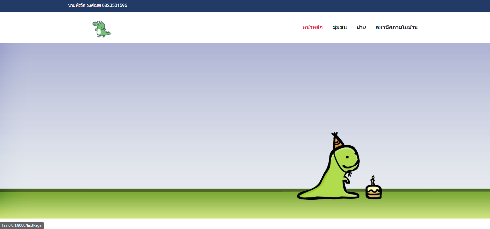
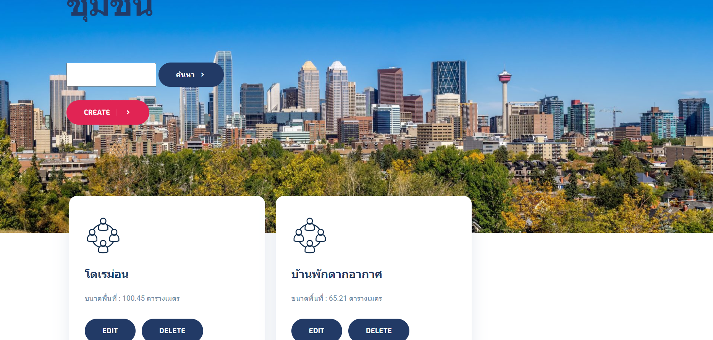

## About this project
This project is about studying database design and using MVC architecture to bring data from the database to display on the website. The website must have CRUD in every database table. Link:https://bservcpe.eng.kps.ku.ac.th/db22/db22_091/laravel/

